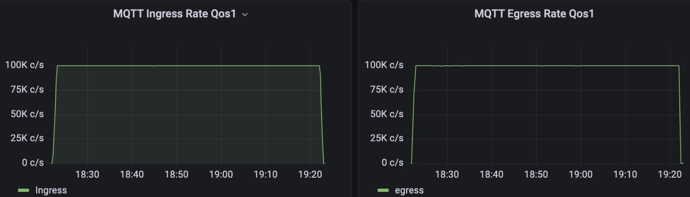
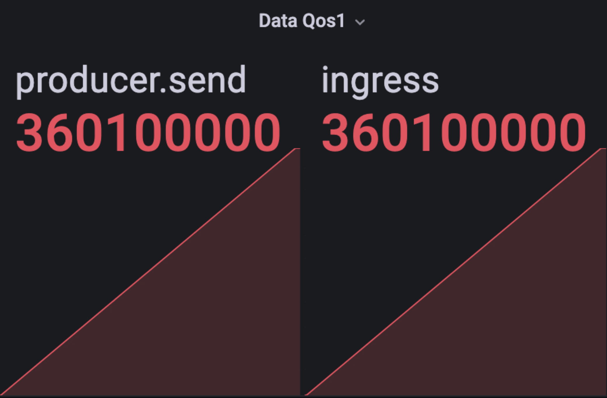

# Simplifying Downstream Integration with BifroMQ's Custom Data Bridge

## Overview
BifroMQ is a messaging middleware designed to facilitate the exchange of messages within an enterprise or distributed 
system. One of the key challenges for this repository addresses is the need to seamlessly integrate with downstream 
middleware, such as Apache Kafka and MySQL, leveraging the property of MQTT shared subscription. This integration is 
crucial when receivers may not consume messages immediately, or when specific business logic requires transitions 
between BifroMQ and downstream systems. Also, it prevents BifroMQ from becoming overly burdened with all processing 
tasks, which helps maintains the lightweight nature of BifroMQ.

In this repository, an SDK has been meticulously crafted, enabling users to implement custom transition logic for their 
downstream systems. Additionally, a practical example demonstrating BifrMQ-to-Kafka has been provided.

The overarching architecture is depicted in the accompanying figure.


## Stress Test
### Test Environment
| Service Name     | Node Num | Version | OS Version     | CPU Resource | Memory Resource |
|------------------|----------|---------|----------------|--------------|-----------------|
| BifroMQ          | 1        | 2.0.0   | Centos7.8      | 64           | 128             |
| Kafka Cluster    | 3        | 2.3.0   | Centos7.8      | 16           | 32              | 
| Clients          | 1        |         | Centos7.8      | 8            | 16              | 

Note: 
* The data-integration service is deployed in the same machine with BifroMQ. However, in production scenarios, this 
  co-location is not necessary.
* The topic transition from BifroMQ to Kafka is in a dummy way, i.e. no extra transition is done.
* The partitionCount is 12 and replicationFactor is 1 in Kafka cluster.

### Test Method
A stress test involves connecting 100,000 clients to BifroMQ at a rate of 2000 connections per second. After completing 
all connections, each client sends a QoS1 message with a 1 KB payload to BifroMQ every second. The data-integration 
service receives these messages and forwards them to the Kafka cluster. The test duration is set to 1 hour, with a focus 
on monitoring BifroMQ's ingress and egress rate, message arrival rate in Kafka, and resource usage.

### Test Results
### Ingress and Egress Rate


### Resources Usage


### Number of Messages Transfers


### BifroMQ Parameters Tuning
### Increase the shared group size
The data-integration service receives messages using MQTT shared subscription for load balancing between receivers. If 
overwhelmed, it's essential to increase the number of receivers beyond BifroMQ's default shared subscription group size 
limit. This can be achieved by implementing the ISettingProvider interface in a [plugin way](https://bifromq.io/docs/2.0.0/plugin/plugin_practice/)
to override default settings.

### Increase the default channel buffer
To reduce traffic congestion from BifroMQ to receivers, BifroMQ actively drops some messages when the receiver's 
available channel buffer is limited. In scenarios with a massive influx of messages, the buffer size can be increased by 
modifying the BifroMQ parameter MaxUserPayloadBytes. The code snippet below provides an example of how to implement 
these settings:
```java
@Extension
public final class CustomizedSettingProvider implements ISettingProvider {
    @Override
    public <R> R provide(Setting setting, String tenantId) {
        if (setting == Setting.MaxSharedGroupMembers) {
            Integer r = 1000;
            return (R) r;
        } else if (setting == Setting.MaxUserPayloadBytes) {
            Integer r = 1024 * 1024;
            return (R) r;
        }
        return setting.current(tenantId);
    }

    @Override
    public void close() {
        ISettingProvider.super.close();
    }
}
```
By employing these tuning strategies, BifroMQ's performance can be optimized for handling varying workloads, ensuring a 
seamless and efficient data integration experience within the middleware ecosystem.
